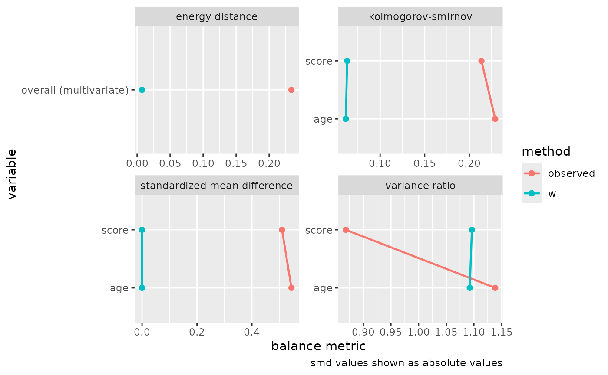

# Get started with balancing

Balancing weights target covariate balance directly. Instead of fitting
a model for the probability of exposure and deriving weights from it, a
balancing method poses covariate balance as a convex optimization
problem and solves for the weights that achieve it. This vignette walks
through the core workflow for a binary exposure: fitting weights with
[`balance()`](https://r-causal.github.io/balancing/reference/balance.md),
reading the balance they achieve, checking that balance more broadly
with halfmoon, and estimating a causal effect.

``` r

# halfmoon provides the balance-assessment tools used throughout this
# vignette.
library(halfmoon)
library(balancing)
```

## A confounded example

We simulate a study with two confounders, `age` and `score`, a binary
`exposure`, and a continuous `outcome`. Both confounders drive the
exposure and the outcome, so a naive comparison of exposed and unexposed
units is biased.

``` r

n <- 800
age <- rnorm(n)
score <- rnorm(n)
exposure <- rbinom(n, 1, plogis(0.5 * age - 0.6 * score))
outcome <- 1 + 0.8 * exposure + 0.7 * age - 0.5 * score + rnorm(n)

study <- data.frame(exposure, age, score, outcome)
```

Before weighting, the exposed and unexposed groups differ on both
confounders. halfmoon’s
[`check_balance()`](https://r-causal.github.io/halfmoon/reference/check_balance.html)
summarizes that imbalance; the `observed` rows are the unweighted
sample, where the standardized mean differences on `age` and `score` run
to about half a standard deviation in opposite directions. The same call
appears again later with the weights attached.

``` r

check_balance(study, c(age, score), exposure)
#> # A tibble: 7 × 5
#>   variable group_level method   metric estimate
#>   <chr>    <chr>       <chr>    <chr>     <dbl>
#> 1 age      0           observed ks        0.229
#> 2 age      0           observed smd       0.544
#> 3 age      0           observed vr        1.14 
#> 4 score    0           observed ks        0.214
#> 5 score    0           observed smd      -0.510
#> 6 score    0           observed vr        0.868
#> 7 NA       NA          observed energy    0.234
```

## Fitting balancing weights

[`balance()`](https://r-causal.github.io/balancing/reference/balance.md)
takes the data frame, the exposure and covariate columns selected with
tidyselect, a method specification, and an estimand. We start with
entropy balancing for the average treatment effect on the treated (ATT),
which reweights the unexposed group to match the covariate means of the
exposed group.

``` r

fit <- balance(
  study,
  exposure,
  c(age, score),
  method = bw_entropy(),
  estimand = "att"
)

fit
#> 
#> ── Entropy balancing ───────────────────────────────────────────────────────────
#> Exposure: "exposure" (binary)
#> Estimand: "att" (focal level "1")
#> Observations: 800
#> Solver: converged in 4 iterations
#> Constraints: 2 terms (tolerance 0)
#> Largest imbalance: 0.0000 (standardized mean difference)
```

The print method summarizes the fit. It reports the method and the
exposure type detected from the data, the estimand and its focal level,
the number of observations, whether the solver converged, and the
largest imbalance the weights leave on the constraint terms. Here the
largest standardized mean difference is effectively zero: entropy
balancing achieves exact mean balance by construction.

## Checking balance with halfmoon

The balance table reports balance on the terms the weights were asked to
balance. To assess balance more broadly, including statistics beyond the
mean and variables the weights did not target, extract the weights with
[`weights()`](https://rdrr.io/r/stats/weights.html) and pass them to the
[halfmoon](https://r-causal.github.io/halfmoon/) package.

``` r

study$w <- weights(fit)
```

Passing the weights to the same
[`check_balance()`](https://r-causal.github.io/halfmoon/reference/check_balance.html)
call compares the weighting scheme against the unweighted sample across
a set of covariates.

``` r

balance_check <- check_balance(
  study,
  c(age, score),
  exposure,
  .weights = w
)
balance_check
#> # A tibble: 14 × 5
#>    variable group_level method   metric  estimate
#>    <chr>    <chr>       <chr>    <chr>      <dbl>
#>  1 age      0           observed ks      2.29e- 1
#>  2 age      0           w        ks      6.15e- 2
#>  3 age      0           observed smd     5.44e- 1
#>  4 age      0           w        smd     2.64e-15
#>  5 age      0           observed vr      1.14e+ 0
#>  6 age      0           w        vr      1.09e+ 0
#>  7 score    0           observed ks      2.14e- 1
#>  8 score    0           w        ks      6.31e- 2
#>  9 score    0           observed smd    -5.10e- 1
#> 10 score    0           w        smd    -6.90e-15
#> 11 score    0           observed vr      8.68e- 1
#> 12 score    0           w        vr      1.10e+ 0
#> 13 NA       NA          observed energy  2.34e- 1
#> 14 NA       NA          w        energy  7.49e- 3
```

[`plot_balance()`](https://r-causal.github.io/halfmoon/reference/plot_balance.html)
renders the same comparison as a love plot.

``` r

plot_balance(balance_check)
```



halfmoon owns the general balance-assessment workflow, so its love
plots, mirrored histograms, and balance summaries are the place to look
when you want a fuller picture than the constraint terms provide. It
also reports the effective sample size, the amount of each group that
survives weighting, through
[`check_ess()`](https://r-causal.github.io/halfmoon/reference/check_ess.html).

## Estimating a causal effect

The weights are a `bw` vector.
[`weights()`](https://rdrr.io/r/stats/weights.html) returns the
balancing weights already multiplied by any sampling weights, so its
result goes straight into a weighted outcome model; there is no need to
compose the sampling weights yourself. Manual composition is only called
for when you have weights from a separate source that the fit does not
carry. With a marginal outcome model, the exposure coefficient is the
weighted effect estimate.

``` r

outcome_mod <- lm(outcome ~ exposure, data = study, weights = w)
coef(outcome_mod)[["exposure"]]
#> [1] 0.7705934
```

The estimate recovers the simulated effect of 0.8, which the unweighted
comparison would have missed.

## Standard errors with `ipw()`

A weighted outcome model’s usual standard errors treat the weights as
fixed, but the weights were themselves estimated. For the
estimating-equation methods (entropy balancing, inverse probability
tilting, and the just-identified covariate balancing propensity score)
with a binary or categorical exposure, and for entropy balancing with a
continuous one,
[`ipw()`](https://r-causal.github.io/causalgenerics/reference/ipw.html)
returns effect estimates with standard errors that account for the
estimation of the weights.

``` r

binary_outcome <- rbinom(n, 1, plogis(-0.3 + 0.6 * exposure + 0.4 * age))
study$event <- binary_outcome

ate_fit <- balance(
  study,
  exposure,
  c(age, score),
  method = bw_entropy(),
  estimand = "ate"
)
study$w_ate <- weights(ate_fit)

event_mod <- glm(
  event ~ exposure,
  data = study,
  family = quasibinomial(),
  weights = w_ate
)

ipw(ate_fit, event_mod)
#> Inverse Probability Weight Estimator
#> Estimand: ATE 
#> Effects: marginal (population-averaged) 
#> 
#> Weight Estimator:
#>   Call: balance(.data = study, .exposure = exposure, .covariates = c(age, 
#>     score), method = bw_entropy(), estimand = "ate") 
#> 
#> Outcome Model:
#>   Call: glm(formula = event ~ exposure, family = quasibinomial(), data = study, 
#>     weights = w_ate) 
#> 
#> Marginal estimates:
#>         estimate  std.err      z ci.lower ci.upper conf.level   p.value    
#> rd      0.134288 0.036908 3.6385  0.06195  0.20663       0.95 0.0002743 ***
#> log(rr) 0.263052 0.073661 3.5711  0.11868  0.40742       0.95 0.0003554 ***
#> log(or) 0.540819 0.150477 3.5940  0.24589  0.83575       0.95 0.0003256 ***
#> ---
#> Signif. codes:  0 '***' 0.001 '**' 0.01 '*' 0.05 '.' 0.1 ' ' 1
```

The
[`vignette("inference")`](https://r-causal.github.io/balancing/articles/inference.md)
article explains why these standard errors differ from the naive ones
and how to obtain valid intervals for the methods that do not carry
estimating equations.

## Where to go next

- [`vignette("choosing-a-method")`](https://r-causal.github.io/balancing/articles/choosing-a-method.md)
  compares the six methods, the exposures and estimands each supports,
  and the constraint options exposed through
  [`balance_terms()`](https://r-causal.github.io/balancing/reference/balance_terms.md).
- [`vignette("inference")`](https://r-causal.github.io/balancing/articles/inference.md)
  covers valid standard errors after balancing, through
  [`ipw()`](https://r-causal.github.io/causalgenerics/reference/ipw.html)
  for the estimating-equation methods and a bootstrap recipe for the
  quadratic-program methods.
